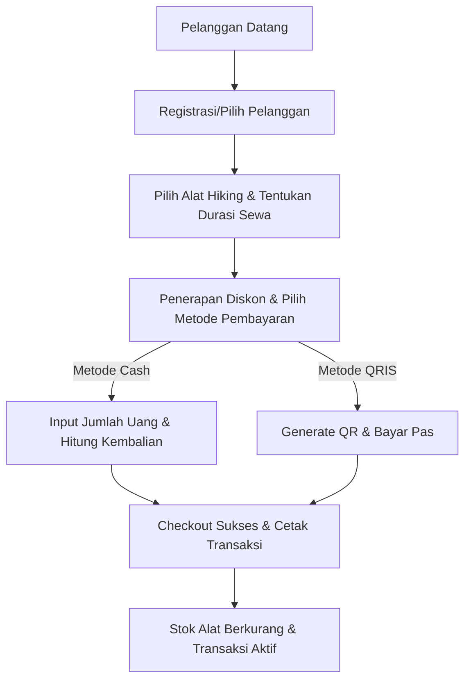
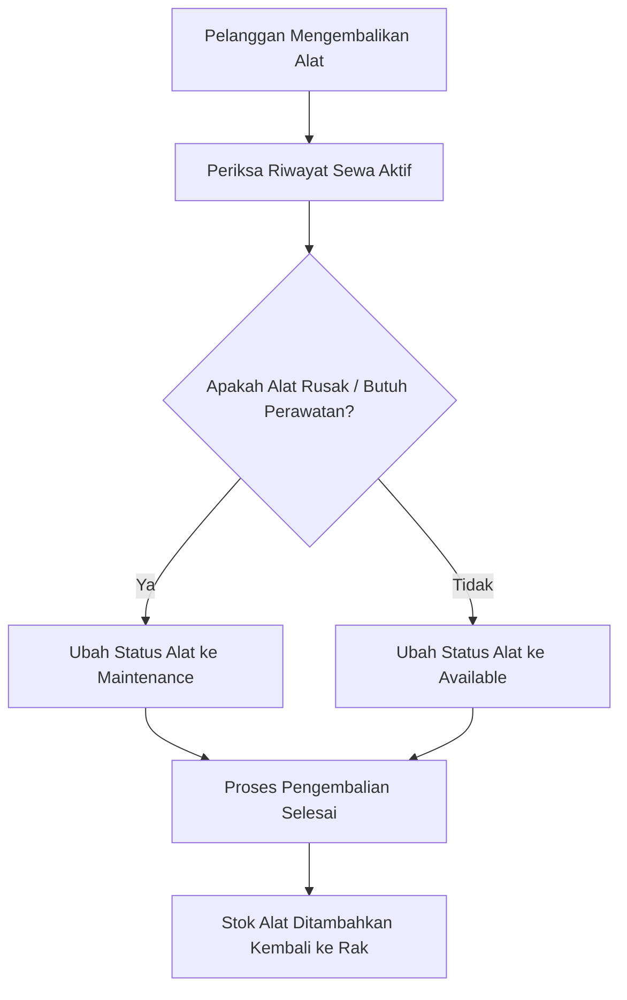

# Business Requirement Document (BRD) — SummitRent

## 1. Ringkasan Eksekutif (Executive Summary)
**SummitRent** adalah platform digital premium yang dirancang khusus untuk memfasilitasi bisnis penyewaan peralatan pendakian gunung dan aktivitas luar ruangan (*outdoor/hiking*). Platform ini memberdayakan pemilik bisnis (*Owner*) dan staf operasional (*Kasir*) dengan menyediakan alat bantu pelacakan inventaris secara real-time, manajemen pelanggan berbasis data wilayah administratif resmi, otomatisasi transaksi pembayaran (Cash & QRIS), penanganan pengembalian barang, serta integrasi asisten kecerdasan buatan (AI) terpusat untuk membantu menganalisis kendala teknis operasional.

---

## 2. Tujuan Bisnis & Nilai Proposisi (Business Goals & Value Proposition)
*   **Efisiensi Operasional:** Mengurangi kesalahan manusia (*human error*) dalam pelacakan stok fisik alat hiking (seperti tenda, ransel, alat masak) dengan integrasi status stok otomatis (`Available`, `Maintenance`, `Out of Stock`).
*   **Transparansi Keuangan:** Memastikan pelaporan pendapatan kasir yang akurat melalui sistem POS (*Point of Sale*) terintegrasi yang menghitung subtotal, potongan harga (diskon), pencatatan nominal tunai yang diterima, uang kembalian, serta integrasi pembayaran QRIS.
*   **Retensi Pelanggan:** Mempermudah pendaftaran identitas pelanggan berbasis nomor KTP/Paspor (NIK) yang tervalidasi secara instan serta pembagian wilayah administratif resmi Indonesia demi ketertelusuran keamanan barang sewa yang tinggi.
*   **Kecepatan Respons Asisten AI:** Menyediakan asisten AI internal (`laravel/ai` + Ollama) untuk membantu kasir memecahkan panduan teknis alat, mempermudah rekomendasi produk, dan merangkum status operasional harian tanpa membuka tab browser luar.

---

## 3. Profil Pengguna & Hak Akses (User Personas & Role Matrix)

### A. Owner (Pemilik Bisnis)
*   **Kebutuhan:** Memantau analitik pendapatan, mengelola neraca keuangan sewa, mengontrol inventaris barang secara penuh, serta mengelola hak akses akun staf.
*   **Hak Akses Utama:**
    *   Mengakses halaman Dashboard keuangan & analisis grafis pendapatan 90 hari terakhir.
    *   Mengakses analisis performa bisnis (*Analytics*).
    *   Melakukan operasi CRUD Akun Staf (Admin & Kasir) serta mengatur izin granular Spatie.
    *   Melakukan operasi CRUD Katalog Inventaris Produk secara penuh.

### B. Kasir (Staf Operasional Toko)
*   **Kebutuhan:** Melayani registrasi pelanggan secara cepat, memproses transaksi sewa, menerima pembayaran, memproses pengembalian alat, dan memantau riwayat transaksi harian.
*   **Hak Akses Utama (Berdasarkan Permission Spatie):**
    *   `products.view`: Melihat katalog produk sewa.
    *   `customers.view` / `create` / `update` / `delete`: Mengelola data identitas pelanggan.
    *   `rentals.view` / `create` / `return` / `cancel`: Memproses transaksi sewa, pengembalian barang, dan pembatalan transaksi sewa.
    *   `ai-chat`: Berinteraksi dengan Asisten AI untuk operasional harian.

---

## 4. Alur Bisnis Utama (Core Business Workflows)

### A. Siklus Transaksi Sewa (Rental Transaction Lifecycle)

### B. Siklus Pengembalian Barang (Return & Maintenance Lifecycle)

---

## 5. Peraturan Bisnis (Business Rules)
1.  **Validasi Identitas Pelanggan:** NIK (Nomor Induk Kependudukan) wajib berupa angka unik dengan panjang tepat 16 karakter guna mencegah penipuan/klaim palsu.
2.  **Keamanan Transaksi Sewa:**
    *   Kasir tidak diizinkan melakukan checkout sewa jika nominal pembayaran tunai (*amount paid*) kurang dari total tagihan bersih (*grand total*).
    *   Durasi sewa minimal adalah 1 hari. Tanggal pengembalian sewa (*until date*) tidak boleh sebelum tanggal mulai sewa (*from date*).
3.  **Manajemen Stok:** Produk yang berstatus `Maintenance` (dalam perawatan) atau `Out of Stock` (habis) secara otomatis tidak dapat dipilih atau dimasukkan ke dalam keranjang transaksi kasir.
4.  **Keamanan Rute API:** Siapa pun pengguna yang masuk ke dalam sistem, otorisasi mereka harus divalidasi ganda: di tingkat UI (React Sidebar) dan di tingkat API Backend (`routes/web.php` via Spatie Permission Middleware).

---

## 6. Indikator Kinerja Utama (Key Performance Indicators - KPI)
-   **Rata-rata Pendapatan Harian & Bulanan (Revenue Metrics):** Dilacak secara live melalui Dashboard keuangan Owner.
-   **Tingkat Utilitas Peralatan (Equipment Utilization Rate):** Memantau seberapa sering kategori alat tertentu (misal: Tenda) disewa dibandingkan dengan durasi tersimpannya di gudang.
-   **Rasio Keterlambatan Pengembalian (Overdue Rental Rate):** Memantau persentase pelanggan yang terlambat mengembalikan alat sewa melebihi batas waktu perjanjian sewa.
-   **Kecerdasan AI Chat Util:** Persentase resolusi masalah panduan kasir secara lokal dibantu asisten AI tanpa eskalasi manual ke pemilik toko.
