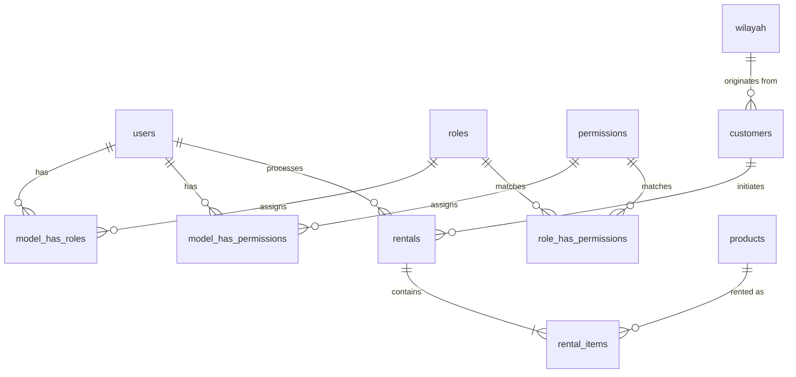

# Database Schema, Relationships, & Workflows — SummitRent

Dokumen ini menyediakan spesifikasi teknis lengkap mengenai skema database, relasi antartabel, dan alur kerja operasional data (*workflows*) pada aplikasi **SummitRent**. Dokumen ini ditulis khusus agar model kecerdasan buatan (seperti Gemini) dapat langsung memahami struktur data dan transaksi database di dalam aplikasi ini.

---

## 1. Entity-Relationship Diagram (ERD)

---

## 2. Struktur Tabel & Kolom (Table Schemas)

### A. Tabel Pengguna & Keamanan (Users & Security)

#### 1. `users`
Menyimpan akun kredensial kasir, admin, dan pemilik bisnis (*Owner*).
- `id` (BigInt, PK, AutoIncrement)
- `name` (String) — Nama staf.
- `email` (String, Unique) — Alamat email login.
- `email_verified_at` (Timestamp, Nullable)
- `password` (String) — Password terenkripsi bcrypt/hash.
- `phone` (String, Nullable) — Nomor HP kontak.
- `country` (String, Default: 'us') — Kode negara domisili.
- `address` (Text, Nullable) — Alamat domisili lengkap.
- `avatar` (String, Nullable) — URL berkas gambar unggahan lokal `/storage/avatars/...` atau URL Dicebear Micah SVG.
- `remember_token` (String, Nullable)
- `created_at` & `updated_at` (Timestamp)

#### 2. Tabel Spatie Laravel Permission (RBAC)
- **`roles`**: Menyimpan data peran utama (`owner`, `kasir`).
  - `id`, `name`, `guard_name`, `created_at`, `updated_at`
- **`permissions`**: Menyimpan izin akses granular (e.g. `products.view`, `customers.create`).
  - `id`, `name`, `guard_name`, `created_at`, `updated_at`
- **`model_has_roles`**: Pivot relasi User ke Role.
  - `role_id` (FK), `model_type` (App\Models\User), `model_id` (user_id, FK)
- **`model_has_permissions`**: Pivot relasi User ke Izin langsung.
  - `permission_id` (FK), `model_type` (App\Models\User), `model_id` (user_id, FK)
- **`role_has_permissions`**: Pivot relasi Role ke Permissions.
  - `permission_id` (FK), `role_id` (FK)

---

### B. Tabel Pelanggan & Wilayah Administratif (Customers & Regions)

#### 3. `wilayah`
Menyimpan data wilayah administratif resmi Indonesia (Provinsi, Kabupaten, Kecamatan, Desa).
- `kode` (String: `13.12.11.1001`, PK) — Kode unik berhierarki menggunakan separator titik `.`.
- `nama` (String) — Nama wilayah (e.g., "BANDUNG, JAWA BARAT").
- `created_at` & `updated_at` (Timestamp)

#### 4. `customers`
Menyimpan data identitas resmi pelanggan sewa alat.
- `id` (BigInt, PK, AutoIncrement)
- `name` (String) — Nama lengkap pelanggan.
- `phone` (String) — Nomor HP aktif.
- `id_number` (String, Unique) — Nomor KTP / Paspor NIK unik 16 digit.
- `email` (String, Unique) — Email pelanggan.
- `wilayah_kode` (String, FK `wilayah.kode`) — Hubungan geografis ke tabel wilayah.
- `address` (Text) — Alamat jalan lengkap tempat tinggal.
- `created_at` & `updated_at` (Timestamp)

---

### C. Tabel Produk Inventaris (Products)

#### 5. `products`
Menyimpan katalog inventaris alat pendakian/ hiking yang dapat disewakan.
- `id` (BigInt, PK, AutoIncrement)
- `name` (String) — Nama peralatan (e.g., "Consina Magnum 4").
- `category` (String) — Kategori alat (`Tent`, `Backpack`, `Sleeping Bag`, `Footwear`, `Cooking Gear`, `Climbing Gear`).
- `description` (Text, Nullable) — Spesifikasi teknis alat.
- `price_per_day` (Decimal: 12, 2) — Tarif tarif sewa harian produk.
- `stock` (Integer) — Jumlah fisik produk yang tersedia di gudang.
- `status` (String, Default: 'available') — Status alat (`available`, `maintenance`, `out_of stock`).
- `image` (String, Nullable) — URL gambar (/storage/products/...) atau URL Unsplash.
- `created_at` & `updated_at` (Timestamp)

---

### D. Tabel Transaksi Sewa (Rentals & POS)

#### 6. `rentals`
Menyimpan transaksi utama sewa yang diproses kasir.
- `id` (BigInt, PK, AutoIncrement)
- `customer_id` (BigInt, FK `customers.id`) — Pelanggan yang menyewa.
- `user_id` (BigInt, FK `users.id`) — Kasir/Admin yang melayani transaksi.
- `start_date` (Date) — Tanggal mulai sewa.
- `end_date` (Date) — Tanggal jatuh tempo sewa harus dikembalikan.
- `total_price` (Decimal: 12, 2) — Tagihan akhir bersih (*grand total*) setelah dikurangi diskon.
- `discount` (Decimal: 12, 2, Default: 0.00) — Potongan harga manual yang diberikan kasir.
- `amount_paid` (Decimal: 12, 2) — Jumlah nominal uang yang dibayarkan pelanggan.
- `change_returned` (Decimal: 12, 2) — Jumlah uang kembalian yang diserahkan ke pelanggan.
- `payment_type` (String, Default: 'cash') — Metode pembayaran sewa (`cash`, `qris`).
- `status` (String, Default: 'active') — Status siklus transaksi sewa (`active`, `returned`, `cancelled`).
- `created_at` & `updated_at` (Timestamp)

#### 7. `rental_items`
Menyimpan rincian produk yang disewa dalam satu nomor transaksi rentals.
- `id` (BigInt, PK, AutoIncrement)
- `rental_id` (BigInt, FK `rentals.id`, CascadeOnDelete) — Nomor transaksi induk.
- `product_id` (BigInt, FK `products.id`) — Produk yang disewa.
- `quantity` (Integer) — Jumlah kuantitas produk yang diambil.
- `price_per_day` (Decimal: 12, 2) — Tarif sewa produk saat sewa terjadi (menghindari efek fluktuasi harga masa depan).
- `total_price` (Decimal: 12, 2) — Subtotal item: `quantity * price_per_day * durasi_hari`.
- `created_at` & `updated_at` (Timestamp)

---

## 3. Alur Data Operasional (Operational Data Workflows)

### Workflow A: Proses Transaksi Checkout Kasir (POS Checkout)
Transaksi checkout melibatkan kalkulasi harga dinamis dan manipulasi stok fisik di database yang dilakukan di dalam satu **Database Transaction Block** (`DB::transaction`):

1.  **Validasi Tanggal & Stok:**
    *   Sistem menghitung durasi sewa: `durasi = end_date - start_date` (Minimal 1 hari).
    *   Memverifikasi setiap `product_id` di keranjang memiliki `stock >= quantity` dan berstatus `available`.
2.  **Perhitungan Harga Sewa:**
    *   Subtotal per item = `quantity * price_per_day * durasi`.
    *   Item Grand Total = `Sum(Subtotal per item)`.
    *   Final Grand Total = `Item Grand Total - discount`.
3.  **Verifikasi Nominal Pembayaran:**
    *   Jika `payment_type == 'cash'`: Memastikan `amount_paid >= Final Grand Total`. Kembalian = `amount_paid - Final Grand Total`.
    *   Jika `payment_type == 'qris'`: Nominal `amount_paid` disamakan dengan `Final Grand Total`, kembalian = `0`.
4.  **Eksekusi Database Transaction:**
    *   Buat baris baru di tabel `rentals`.
    *   Loop keranjang sewa: buat baris baru di `rental_items`.
    *   **Pengurangan Stok:** Potong stok produk fisik: `products.stock = products.stock - quantity`. Jika stok menjadi `0`, ubah status produk menjadi `out_of_stock`.
    *   Kirim broadcast notifikasi real-time via WebSocket (`StockLowAlert` jika stok produk di bawah batas aman, dan `RentalStatusChanged`).

---

### Workflow B: Proses Pengembalian Sewa (Return Processing)
Ketika pelanggan mengembalikan barang, kasir memproses pengembalian sewa:

1.  **Pencarian Transaksi Sewa:**
    *   Mencari record transaksi `rentals` berstatus `active` berdasarkan ID sewa.
2.  **Pengembalian Stok Fisik:**
    *   Eager-load `rental_items` terkait untuk mengambil daftar produk sewa.
    *   Loop setiap item: **Tambahkan kembali stok produk** di database: `products.stock = products.stock + quantity`.
    *   Jika status produk sebelumnya `out_of_stock`, ubah status produk kembali menjadi `available`.
3.  **Pembaruan Status Transaksi:**
    *   Ubah status transaksi sewa: `rentals.status = 'returned'`.
4.  **Siaran Real-Time:**
    *   Kirim broadcast WebSocket `RentalStatusChanged` untuk memperbarui notifikasi bell kasir dan grafik analytics Owner secara instan.

---

### Workflow C: Pencarian Cascading Wilayah Administratif
Untuk efisiensi pencarian database wilayah tanpa merusak memori RAM browser:

1.  **Pencarian Kode Hierarki:**
    *   Provinsi: Query kode wilayah berpanjang 2 karakter (e.g. `11`, `12`).
    *   Kabupaten: Query kode wilayah yang diawali kode provinsi + panjang 5 karakter (e.g. `11.01`, `11.02`).
    *   Kecamatan: Query kode wilayah diawali kode kabupaten + panjang 8 karakter (e.g. `11.01.01`).
    *   Kelurahan: Query kode wilayah diawali kode kecamatan + panjang 13 karakter (e.g. `11.01.01.2001`).
2.  **Live Search (Autocomplete):**
    *   Pencarian teks menggunakan klausa `WHERE nama LIKE %query%` dibatasi paginate 10 untuk menjaga queries responsif kurang dari `50ms`.
